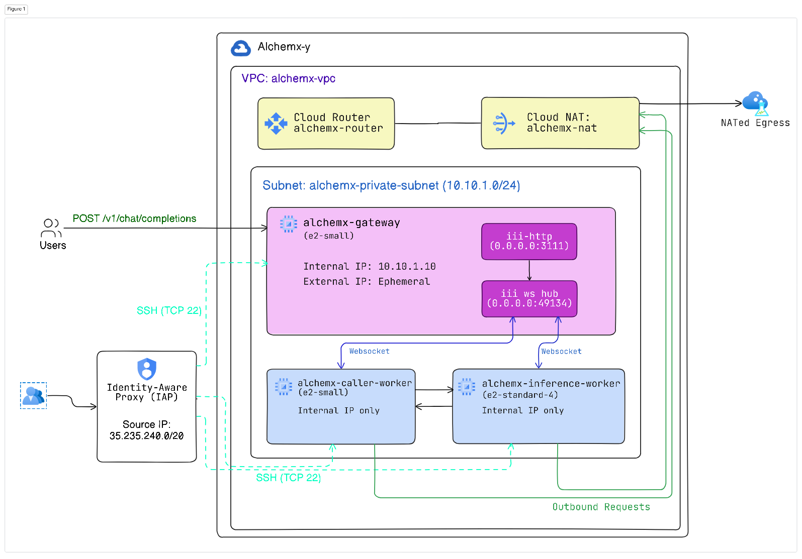

# alchemx-y — Distributed Inference Mesh on GCP

A small language model served through a distributed [iii](https://iii.dev) worker mesh on Google Cloud, provisioned end-to-end with Terraform. Inference runs on VMs with **no public IP**; only a single API gateway faces the internet. Workers talk to each other over a private subnet.

---

## Architecture



| VM | Public IP | systemd service | Role |
| --- | --- | --- | --- |
| `alchemx-gateway` | yes | `iii-engine` | HTTP API (`:3111`) + worker hub (`:49134`) |
| `alchemx-caller-worker` | **no** | `caller-worker` | registers the HTTP route, orchestrates the call |
| `alchemx-inference-worker` | **no** | `inference-worker` | loads and runs the model |

**Request flow:** client `POST`s JSON to the gateway → gateway hands it to `caller-worker` → `caller-worker` calls `inference::run_inference` on `inference-worker` over the mesh → text returns up the chain as a JSON response. The gateway is the only public hop; both workers stay private.

---

## Network isolation

Two independent layers keep the workers private:

- **No external IP** — the worker VMs are created without an `access_config` block, so GCP assigns them no public address.
- **Firewall** — a custom-mode VPC denies all ingress by default. Three rules open the minimum:

| Rule | Port | Source | Applies to |
| --- | --- | --- | --- |
| `alchemx-allow-api` | `tcp:3111` | `0.0.0.0/0` | gateway only |
| `alchemx-allow-internal` | `tcp`, `icmp` | `10.10.1.0/24` | all VMs |
| `alchemx-allow-ssh-iap` | `tcp:22` | `35.235.240.0/20` (IAP) | all VMs |

The hub port `:49134` is never opened to the internet, so it is reachable only from inside the subnet. The private VMs reach out for package installs and the model download through **Cloud NAT** — egress only, no inbound.

---

## What I changed to make it work

The app code is the iii quickstart, unmodified except for these fixes:

- **`inference_worker.py` — capped `max_new_tokens`.** The default (32000) made CPU generation run for minutes and blow past the 30s HTTP timeout, orphaning the request. Lowered to 256.
- **`inference_worker.py` — return a dict, not a string.** Returning a bare string made the JS side spread it into a character-indexed object (`{"0":"E","1":"x",...}`). Now returns `{"content": result}`.
- **`worker.ts` — typed the RPC result** as `Record<string, unknown>` so the `tsc` build accepts the object spread.
- **Startup scripts — `export HOME=/root`.** Boot scripts run as root with no `$HOME`; the iii installer and the HuggingFace cache both need it. Also set as `Environment=HOME=/root` in the worker units.
- **Pinned the gateway's internal IP** to `10.10.1.10` so workers can target a fixed `III_URL` regardless of boot order.

---

## Deploy

**Prerequisites:** a GCP project with billing and the Compute Engine API enabled, `gcloud auth application-default login`, and Terraform installed.

```bash
cd infra/terraform
terraform init
terraform plan
terraform apply        # review, then: yes
```

The VMs need a few minutes after `apply` to finish their startup scripts and come online.

**Verify:**

```bash
terraform output gateway_public_ip

curl -X POST http://<gateway_public_ip>:3111/v1/chat/completions \
  -H 'Content-Type: application/json' \
  -d '{"messages":[{"role":"user","content":"What is 2+2?"}]}'
```

```json
{
  "result": {
    "content": "Whose name is 2+2?\nWhose name is 2+2?\nWhose name is 2+2?\n…",
    "success": "You've connected two workers and they're interoperating seamlessly, now let's add a few more workers to expand this project's functionality."
  }
}
```

The `content` text is low-quality and repetitive — expected from `gemma-3-270m`, a 270M-parameter model.

**Confirm isolation** (workers show no external IP; egress still works through NAT):

```bash
gcloud compute instances list
gcloud compute ssh alchemx-inference-worker --zone=asia-south2-a \
  --tunnel-through-iap --command="curl -s https://ifconfig.me"
```

**Tear down:**

```bash
terraform destroy
```

---

## Repository layout

```
alchemx-y/
├── app/workers/{caller-worker,inference-worker}/   # iii quickstart app code
└── infra/
    ├── terraform/   # provider, variables, network, firewall, compute, outputs
    └── startup/     # per-VM provisioning scripts
```

Each VM's role is set by a `metadata_startup_script` that installs dependencies, clones the repo, writes a systemd unit, and starts it. 

---

## Production hardening (to be done later)

**Network** — currently tcp communication on every port is allowed internally, narrow it down to tcp:49134 only.

**Identity & secrets** — run services as a dedicated least-privilege service account, not root; move Terraform state to a GCS backend.

**Edge** — terminate TLS at a reverse proxy / HTTPS load balancer (the engine has none); add authentication to the public endpoint (currently open); tighten CORS and pin an explicit engine config instead of `--use-default-config`.

**Compute** — the inference worker currently runs CPU-only (`e2-standard-4`), which is slow and can't take real load. Move it to a GPU machine type (L4/A100) so generation runs on the accelerator instead of the CPU.

---

## Scaling to a 100x larger model

A ~27B model moves the inference tier from CPU to accelerators. The mesh already scales each tier independently:

- **More throughput** — run multiple inference-workers in an autoscaling Managed Instance Group. They all self-register `inference::run_inference` and the engine spreads calls across them.
- **Resilience** — the single engine is a SPOF; run several behind a load balancer.

---

## Stack

GCP (Compute Engine, VPC, Cloud NAT, IAP) · Terraform · iii · systemd · Python (transformers, PyTorch) · TypeScript (Node 20)
